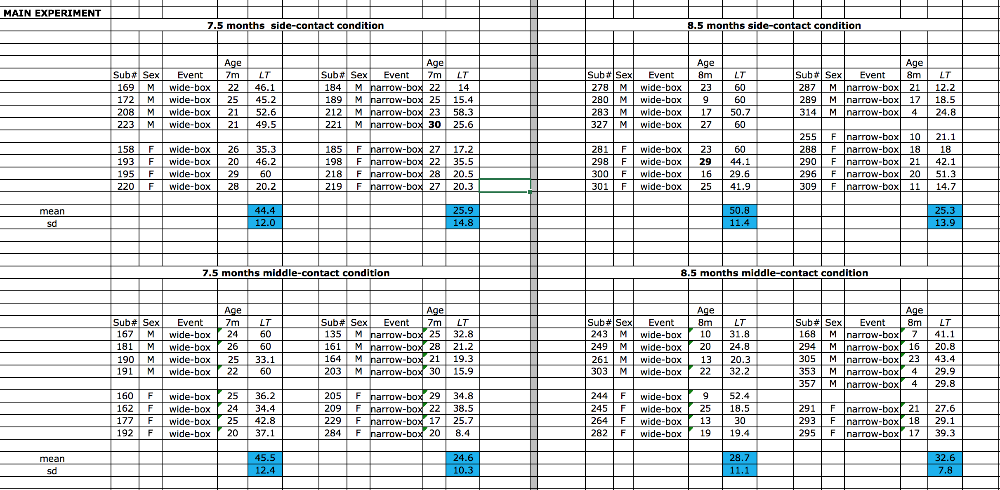
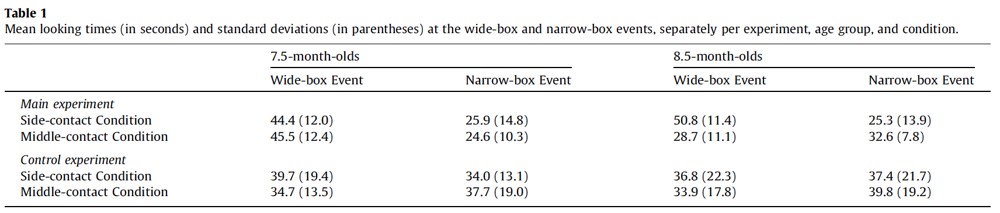

#### Article ID: htkUz
#### Pilot: Psych_MJ
#### Copilot: Maya Mathur
#### Start date: Mar 1 2017
#### End date: Nov 8 2017
#### Final verification: Tom Hardwicke
#### Date: Nov 17 2017

-------

#### Methods summary: 

The experiment has three between subject conditions: age (7.5 vs. 8.5-month-olds), condition (side vs. middle-contact), and event (wide vs. narrow-box). Authors have used an ANOVA, as well as planned comparisons to support the following claim: 

> 7.5- but not 8.5-month-olds viewed as unexpected a possible event in which a wide box remained stable when released with only the middle third of its bottom surface resting on a narrow platform. 

------

#### Target outcomes: 

> Infants' looking times in the main experiment (Fig. 3, Table 1) were compared by an ANOVA with age (7.5 or 8.5 months), condition (side- or middle-contact), and event (wide- or narrow-box) as between-subjects factors. The analysis yielded a significant main effect of event, F(1, 56) = 26.25, p < 0.0001, a significant Condition $\times$ Event interaction, F(1, 56) = 5.18, p < 0.05, and, critically, a significant Age $\times$ Condition $\times$ Event interaction, F(1, 56) = 7.13, p < 0.01, $\eta_p^2$ = 0.11. As predicted, planned comparisons revealed that at 7.5 months, infants in both the side-contact condition, F(1, 56) = 9.73, p < 0.005, Cohen's d = 1.38, and the middle-contact condition, F(1, 56) = 12.32, p < 0.001, d = 1.83, looked reliably longer if shown the wide-box as opposed to the narrow-box event; at 8.5 months, infants in the side-contact condition again looked reliably longer if shown the wide-box as opposed to the narrow-box event, F(1, 56) = 18.33, p < 0.0001, d = 2.00, but infants in the middle-contact condition looked equally at the two events, F(1, 56) < 1. The two age groups differed reliably in their looking times at the wide-box event in the middle-contact condition, F(1, 56) = 7.96, p < 0.01, d = 1.43, but not the side-contact condition, F(1, 56) = 1.16, p > 0.25; there were no significant differences for the narrow-box event, both Fs(1, 56) < 1.84, ps > 0.20.

```{r global_options, include=FALSE}
knitr::opts_chunk$set(echo=TRUE, warning=FALSE, message=FALSE)

# prepare an empty report object, we will update this each time we run compareValues2()
reportObject <- data.frame("Article_ID" = NA, "valuesChecked" = 0, "eyeballs" = 0, "Total_df" = 0, "Total_p" = 0, "Total_mean" = 0, "Total_sd" = 0, "Total_se" = 0, "Total_ci" = 0, "Total_bf" = 0, "Total_t" = 0, "Total_F" = 0, "Total_es" = 0, "Total_median" = 0, "Total_irr" = 0, "Total_r" = 0, "Total_z" = 0, "Total_coeff" = 0, "Total_n" = 0, "Total_x2" = 0, "Total_other" = 0, "Insufficient_Information_Errors" = 0, "Decision_Errors" = 0, "Major_Numerical_Errors" = 0, "Minor_Numerical_Errors" = 0, "Major_df" = 0, "Major_p" = 0, "Major_mean" = 0, "Major_sd" = 0, "Major_se" = 0, "Major_ci" = 0, "Major_bf" = 0, "Major_t" = 0, "Major_F" = 0, "Major_es" = 0, "Major_median" = 0, "Major_irr" = 0, "Major_r" = 0, "Major_z" = 0, "Major_coeff" = 0, "Major_n" = 0, "Major_x2" = 0, "Major_other" = 0, "affectsConclusion" = NA, "error_typo" = 0, "error_specification" = 0, "error_analysis" = 0, "error_data" = 0, "error_unidentified" = 0, "Author_Assistance" = NA, "resolved_typo" = 0, "resolved_specification" = 0, "resolved_analysis" = 0, "resolved_data" = 0, "correctionSuggested" = NA, "correctionPublished" = NA)
```

## Step 1: Load packages

```{r}
library(tidyverse) # for data munging
library(readr)
library(knitr) # for kable table formating
library(haven) # import and export 'SPSS', 'Stata' and 'SAS' Files
library(readxl) # import excel files
library(CODreports) # custom report functions
library(lsr) # to calculate eta squared
```

## Step 2: Load data

The original excel data file is extremely clean and clear to understand. However, it is not in a tidy format or any format that can be directly imported into a statistics program. You can see a screenshot of the original data file below.  

 

I manually restructed the original data file so it can be imported into R in long format (data_manualclean.csv). The new file has three extra columns: experiment (main vs. control), condition (side vs. middle), and age in months (7.5 vs 8.5). The blocks of data have 5 columns each. I stacked them according to their experiment type, condition, and age, and created a tidy csv file.

## Step 3: Tidy data

```{r}
cleaned_data <- read.csv("./data/data_manualClean.csv")
cleaned_data$age_months <- as.factor(cleaned_data$age_months)
head(cleaned_data)
```

## Step 4: Run analysis

### Descriptive statistics

The table below summarizes the descriptive statistics reported in the paper.

 

The code below reproduces all the reported statistics of Table 1 successfully (16 matches).

```{r}
table1 <-
cleaned_data %>%
  group_by(experiment, age_months, condition, event) %>%
  summarise(LT_mean = mean(LT), LT_sd=sd(LT))

kable(table1, digits = 1)


##### Compare Values #####

# check means and SDs in the order they appear in paper
# column 1
m <- table1 %>% filter(experiment == 'main', age_months == '7.5', condition == 'side', event == 'wide-box') %>% pull(LT_mean)
sd <- table1 %>% filter(experiment == 'main', age_months == '7.5', condition == 'side', event == 'wide-box') %>% pull(LT_sd)

reportObject <- compareValues2(reportedValue = "44.4", obtainedValue = m, valueType = 'mean')
reportObject <- compareValues2(reportedValue = "12", obtainedValue = sd, valueType = 'sd')

m <- table1 %>% filter(experiment == 'main', age_months == '7.5', condition == 'middle', event == 'wide-box') %>% pull(LT_mean)
sd <- table1 %>% filter(experiment == 'main', age_months == '7.5', condition == 'middle', event == 'wide-box') %>% pull(LT_sd)

reportObject <- compareValues2(reportedValue = "45.5", obtainedValue = m, valueType = 'mean')
reportObject <- compareValues2(reportedValue = "12.4", obtainedValue = sd, valueType = 'sd')

m <- table1 %>% filter(experiment == 'control', age_months == '7.5', condition == 'side', event == 'wide-box') %>% pull(LT_mean)
sd <- table1 %>% filter(experiment == 'control', age_months == '7.5', condition == 'side', event == 'wide-box') %>% pull(LT_sd)

reportObject <- compareValues2(reportedValue = "39.7", obtainedValue = m, valueType = 'mean')
reportObject <- compareValues2(reportedValue = "19.4", obtainedValue = sd, valueType = 'sd')

m <- table1 %>% filter(experiment == 'control', age_months == '7.5', condition == 'middle', event == 'wide-box') %>% pull(LT_mean)
sd <- table1 %>% filter(experiment == 'control', age_months == '7.5', condition == 'middle', event == 'wide-box') %>% pull(LT_sd)

reportObject <- compareValues2(reportedValue = "34.7", obtainedValue = m, valueType = 'mean')
reportObject <- compareValues2(reportedValue = "13.5", obtainedValue = sd, valueType = 'sd')

# column 2
m <- table1 %>% filter(experiment == 'main', age_months == '7.5', condition == 'side', event == 'narrow-box') %>% pull(LT_mean)
sd <- table1 %>% filter(experiment == 'main', age_months == '7.5', condition == 'side', event == 'narrow-box') %>% pull(LT_sd)

reportObject <- compareValues2(reportedValue = "25.9", obtainedValue = m, valueType = 'mean')
reportObject <- compareValues2(reportedValue = "14.8", obtainedValue = sd, valueType = 'sd')

m <- table1 %>% filter(experiment == 'main', age_months == '7.5', condition == 'middle', event == 'narrow-box') %>% pull(LT_mean)
sd <- table1 %>% filter(experiment == 'main', age_months == '7.5', condition == 'middle', event == 'narrow-box') %>% pull(LT_sd)

reportObject <- compareValues2(reportedValue = "24.6", obtainedValue = m, valueType = 'mean')
reportObject <- compareValues2(reportedValue = "10.3", obtainedValue = sd, valueType = 'sd')

m <- table1 %>% filter(experiment == 'control', age_months == '7.5', condition == 'side', event == 'narrow-box') %>% pull(LT_mean)
sd <- table1 %>% filter(experiment == 'control', age_months == '7.5', condition == 'side', event == 'narrow-box') %>% pull(LT_sd)

reportObject <- compareValues2(reportedValue = "34.0", obtainedValue = m, valueType = 'mean')
reportObject <- compareValues2(reportedValue = "13.1", obtainedValue = sd, valueType = 'sd')

m <- table1 %>% filter(experiment == 'control', age_months == '7.5', condition == 'middle', event == 'narrow-box') %>% pull(LT_mean)
sd <- table1 %>% filter(experiment == 'control', age_months == '7.5', condition == 'middle', event == 'narrow-box') %>% pull(LT_sd)

reportObject <- compareValues2(reportedValue = "37.7", obtainedValue = m, valueType = 'mean')
reportObject <- compareValues2(reportedValue = "19.0", obtainedValue = sd, valueType = 'sd')


# column 3
m <- table1 %>% filter(experiment == 'main', age_months == '8.5', condition == 'side', event == 'wide-box') %>% pull(LT_mean)
sd <- table1 %>% filter(experiment == 'main', age_months == '8.5', condition == 'side', event == 'wide-box') %>% pull(LT_sd)

reportObject <- compareValues2(reportedValue = "50.8", obtainedValue = m, valueType = 'mean')
reportObject <- compareValues2(reportedValue = "11.4", obtainedValue = sd, valueType = 'sd')

m <- table1 %>% filter(experiment == 'main', age_months == '8.5', condition == 'middle', event == 'wide-box') %>% pull(LT_mean)
sd <- table1 %>% filter(experiment == 'main', age_months == '8.5', condition == 'middle', event == 'wide-box') %>% pull(LT_sd)

reportObject <- compareValues2(reportedValue = "28.7", obtainedValue = m, valueType = 'mean')
reportObject <- compareValues2(reportedValue = "11.1", obtainedValue = sd, valueType = 'sd')

m <- table1 %>% filter(experiment == 'control', age_months == '8.5', condition == 'side', event == 'wide-box') %>% pull(LT_mean)
sd <- table1 %>% filter(experiment == 'control', age_months == '8.5', condition == 'side', event == 'wide-box') %>% pull(LT_sd)

reportObject <- compareValues2(reportedValue = "36.8", obtainedValue = m, valueType = 'mean')
reportObject <- compareValues2(reportedValue = "22.3", obtainedValue = sd, valueType = 'sd')

m <- table1 %>% filter(experiment == 'control', age_months == '8.5', condition == 'middle', event == 'wide-box') %>% pull(LT_mean)
sd <- table1 %>% filter(experiment == 'control', age_months == '8.5', condition == 'middle', event == 'wide-box') %>% pull(LT_sd)

reportObject <- compareValues2(reportedValue = "33.9", obtainedValue = m, valueType = 'mean')
reportObject <- compareValues2(reportedValue = "17.8", obtainedValue = sd, valueType = 'sd')


    
# column 4
m <- table1 %>% filter(experiment == 'main', age_months == '8.5', condition == 'side', event == 'narrow-box') %>% pull(LT_mean)
sd <- table1 %>% filter(experiment == 'main', age_months == '8.5', condition == 'side', event == 'narrow-box') %>% pull(LT_sd)

reportObject <- compareValues2(reportedValue = "25.3", obtainedValue = m, valueType = 'mean')
reportObject <- compareValues2(reportedValue = "13.9", obtainedValue = sd, valueType = 'sd')

m <- table1 %>% filter(experiment == 'main', age_months == '8.5', condition == 'middle', event == 'narrow-box') %>% pull(LT_mean)
sd <- table1 %>% filter(experiment == 'main', age_months == '8.5', condition == 'middle', event == 'narrow-box') %>% pull(LT_sd)

reportObject <- compareValues2(reportedValue = "32.6", obtainedValue = m, valueType = 'mean')
reportObject <- compareValues2(reportedValue = "7.8", obtainedValue = sd, valueType = 'sd')

m <- table1 %>% filter(experiment == 'control', age_months == '8.5', condition == 'side', event == 'narrow-box') %>% pull(LT_mean)
sd <- table1 %>% filter(experiment == 'control', age_months == '8.5', condition == 'side', event == 'narrow-box') %>% pull(LT_sd)

reportObject <- compareValues2(reportedValue = "37.4", obtainedValue = m, valueType = 'mean')
reportObject <- compareValues2(reportedValue = "21.7", obtainedValue = sd, valueType = 'sd')

m <- table1 %>% filter(experiment == 'control', age_months == '8.5', condition == 'middle', event == 'narrow-box') %>% pull(LT_mean)
sd <- table1 %>% filter(experiment == 'control', age_months == '8.5', condition == 'middle', event == 'narrow-box') %>% pull(LT_sd)

reportObject <- compareValues2(reportedValue = "39.8", obtainedValue = m, valueType = 'mean')
reportObject <- compareValues2(reportedValue = "19.2", obtainedValue = sd, valueType = 'sd')
```

### Inferential statistics

Going back to the target outcomes, the paper has reported a couple of ANOVAs: 

> Infants' looking times in the main experiment (Fig. 3, Table 1) were compared by an ANOVA with age (7.5 or 8.5 months), condition (side- or middle-contact), and event (wide- or narrow-box) as between-subjects factors. The analysis yielded a significant main effect of event, F(1, 56) = 26.25, p < 0.0001, a significant Condition $\times$ Event interaction, F(1, 56) = 5.18, p < 0.05, and, critically, a significant Age $\times$ Condition $\times$ Event interaction, F(1, 56) = 7.13, p < 0.01, $\eta_p^2$ = 0.11.

Below, I reproduce the above analysis in R:

```{r}
main_data <- filter(cleaned_data, experiment=="main")
model <- lm(LT ~ age_months * condition * event, data=main_data)
anova(model)
etaSquared(model)

# dfs
reportObject <- compareValues2( reportedValue = "1", obtainedValue = anova(model)[[ "event", "Df"]], valueType = 'df')
reportObject <- compareValues2( reportedValue = "56", obtainedValue = anova(model)[[ "Residuals", "Df"]], valueType = 'df')

# F stat
reportObject <- compareValues2( reportedValue = "26.25", obtainedValue = anova(model)[[ "event", "F value"]], valueType = 'F')

reportObject <- compareValues2( reportedValue = "eyeballMATCH", obtainedValue = anova(model)[[ "event", "Pr(>F)"]], valueType = 'p')

reportObject <- compareValues2( reportedValue = "5.18", obtainedValue = anova(model)[[ "condition:event", "F value"]], valueType = 'F')

reportObject <- compareValues2( reportedValue = "eyeballMATCH", obtainedValue = anova(model)[[ "condition:event", "Pr(>F)"]], valueType = 'p')

reportObject <- compareValues2( reportedValue = "7.13", obtainedValue = anova(model)[[ "age_months:condition:event", "F value"]], valueType = 'F')

reportObject <- compareValues2( reportedValue = "eyeballMATCH", obtainedValue = anova(model)[[ "age_months:condition:event", "Pr(>F)"]], valueType = 'p')

# effect size (eta^2)
reportObject <- compareValues2( reportedValue = "0.11", obtainedValue = etaSquared(model)[[ "age_months:condition:event", "eta.sq.part"]], valueType = 'es')
```

All the significant results reported are successfully reproduced. The effect size $\eta_p^2$ is also accurately reported.

> As predicted, planned comparisons revealed that at 7.5 months, infants in both the side-contact condition, F(1, 56) = 9.73, p < 0.005, Cohen's d = 1.38, and the middle-contact condition, F(1, 56) = 12.32, p < 0.001, d = 1.83, looked reliably longer if shown the wide-box as opposed to the narrow-box event. 

```{r}
##### (7.5 mos, side, wide) - (7.5 mos, side, narrow) #####
# reference group: 7.5 mos, side, narrow
# now with middle contact as reference level
model = lm(LT ~ age_months * C( main_data$condition, base = 2 ) * event, data=main_data)
summ = summary(model)

# dfs
reportObject <- compareValues2( reportedValue = "1", obtainedValue = anova(model)[[ "event", "Df"]], valueType = 'df')
reportObject <- compareValues2( reportedValue = "56", obtainedValue = anova(model)[[ "Residuals", "Df"]], valueType = 'df')

# F stat
reportObject <- compareValues2( reportedValue = "9.72", obtainedValue = summ$coefficients[[ "eventwide-box", "t value" ]]^2, valueType = 'F')

# yes, p < 0.005
reportObject <- compareValues2( reportedValue = "eyeballMATCH", obtainedValue = summ$coefficients[[ "eventwide-box", "Pr(>|t|)" ]], valueType = 'p')

# Cohen's d
reportObject <- compareValues2( reportedValue = "1.38", obtainedValue = cohensD( LT ~ event, data=main_data[ main_data$age_months == "7.5" & main_data$condition == "side", ] ), valueType = 'es')


#### (7.5 mos, middle, wide) - (7.5 mos, middle, narrow) #####
# reference group: 7.5 mos, middle, narrow
# same fit as before
model <- lm(LT ~ age_months * condition * event, data=main_data)
summ = summary(model)

# dfs
reportObject <- compareValues2( reportedValue = "1", obtainedValue = anova(model)[[ "event", "Df"]], valueType = 'df')
reportObject <- compareValues2( reportedValue = "56", obtainedValue = anova(model)[[ "Residuals", "Df"]], valueType = 'df')

# F-stat
reportObject <- compareValues2( reportedValue = "12.32", obtainedValue = summ$coefficients[[ "eventwide-box", "t value" ]]^2, valueType = 'F')

# yes, p < 0.001
reportObject <- compareValues2( reportedValue = "eyeballMATCH", obtainedValue = summ$coefficients[[ "eventwide-box", "Pr(>|t|)" ]], valueType = 'p')

# Cohen's d
reportObject <- compareValues2( reportedValue = "1.83", obtainedValue = cohensD( LT ~ event, data=main_data[ main_data$age_months == "7.5" & main_data$condition == "middle", ] ), valueType = 'es')

```


> At 8.5 months, infants in the side-contact condition again looked reliably longer if shown the wide-box as opposed to the narrow-box event, F(1, 56) = 18.33, p < 0.0001, d = 2.00, but infants in the middle-contact condition looked equally at the two events, F(1, 56) < 1.


```{r}
##### (8.5 mos, side, wide) - (8.5 mos, side, narrow) ######
# reference group: 8.5 mos, side, narrow
model = lm(LT ~ C( main_data$age_months, base = 2 ) * C( main_data$condition, base = 2 ) * event, data=main_data)
summ = summary(model)

# dfs
reportObject <- compareValues2( reportedValue = "1", obtainedValue = anova(model)[[ "event", "Df"]], valueType = 'df')
reportObject <- compareValues2( reportedValue = "56", obtainedValue = anova(model)[[ "Residuals", "Df"]], valueType = 'df')

# F stat
reportObject <- compareValues2( reportedValue = "18.33", obtainedValue = summ$coefficients[[ "eventwide-box", "t value" ]]^2, valueType = 'F')

# yes, p < 0.0001
reportObject <- compareValues2( reportedValue = "eyeballMATCH", obtainedValue = summ$coefficients[[ "eventwide-box", "Pr(>|t|)" ]], valueType = 'p')

# Cohen's d
reportObject <- compareValues2( reportedValue = "2.00", obtainedValue = cohensD( LT ~ event, data=main_data[ main_data$age_months == "8.5" & main_data$condition == "side", ] ), valueType = 'es')


##### (8.5 mos, middle, wide) - (8.5 mos, middle, narrow) #####
# reference group: 8.5 mos, middle, narrow
model <- lm(LT ~ C( main_data$age_months, base=2 ) * condition * event, data=main_data)
summ = summary(model)

# yes, F < 1
reportObject <- compareValues2( reportedValue = "eyeballMATCH", obtainedValue = summ$coefficients[[ "eventwide-box", "t value" ]]^2, valueType = 'F')
```

> The two age groups differed reliably in their looking times at the wide-box event in the middle-contact condition, F(1, 56) = 7.96, p < 0.01, d = 1.43, but not the side-contact condition, F(1, 56) = 1.16, p > 0.25; ...

```{r}
##### (8.5 mos, middle, wide) - (7.5 mos, middle, wide) ######
# reference group: 8.5 mos, middle, wide
model = lm(LT ~ age_months * condition * C( main_data$event, base=2 ), data=main_data)
summ = summary(model)

# dfs
reportObject <- compareValues2( reportedValue = "1", obtainedValue = anova(model)[[ "age_months", "Df"]], valueType = 'df')
reportObject <- compareValues2( reportedValue = "56", obtainedValue = anova(model)[[ "Residuals", "Df"]], valueType = 'df')

# F stat
reportObject <- compareValues2( reportedValue = "7.96", obtainedValue = summ$coefficients[[ "age_months8.5", "t value" ]]^2, valueType = 'F')

# yes, p < 0.01
reportObject <- compareValues2( reportedValue = "eyeballMATCH", obtainedValue = summ$coefficients[[ "age_months8.5", "Pr(>|t|)" ]], valueType = 'p')


# Cohen's d
reportObject <- compareValues2( reportedValue = "1.43", obtainedValue = cohensD( LT ~ age_months, data=main_data[ main_data$event == "wide-box" & main_data$condition == "middle", ] ), valueType = 'es')


##### (8.5 mos, side, narrow) - (7.5 mos, side, narrow) ######
# reference group: 8.5 mos, middle, narrow
model = lm(LT ~ age_months * C( main_data$condition, base=2 ) * C( main_data$event, base=2 ), data=main_data)
summ = summary(model)

# dfs
reportObject <- compareValues2( reportedValue = "1", obtainedValue = anova(model)[[ "age_months", "Df"]], valueType = 'df')
reportObject <- compareValues2( reportedValue = "56", obtainedValue = anova(model)[[ "Residuals", "Df"]], valueType = 'df')

# F stat
reportObject <- compareValues2( reportedValue = "1.16", obtainedValue = summ$coefficients[[ "age_months8.5", "t value" ]]^2, valueType = 'F')

# yes, p > 0.25
reportObject <- compareValues2( reportedValue = "eyeballMATCH", obtainedValue = summ$coefficients[[ "age_months8.5", "Pr(>|t|)" ]], valueType = 'p')

```

> ... there were no significant differences for the narrow-box event, both Fs(1, 56) < 1.84, ps > 0.20.

```{r}
###### (8.5, middle, narrow) - (7.5, middle, narrow) #####
model <- lm(LT ~ age_months * condition * event, data=main_data)
summ = summary(model)

# dfs
reportObject <- compareValues2( reportedValue = "1", obtainedValue = anova(model)[[ "age_months", "Df"]], valueType = 'df')
reportObject <- compareValues2( reportedValue = "56", obtainedValue = anova(model)[[ "Residuals", "Df"]], valueType = 'df')

# F
reportObject <- compareValues2( reportedValue = "eyeballMATCH", obtainedValue = summ$coefficients[[ "age_months8.5", "t value" ]]^2, valueType = 'F')

# p (just under boundary - probably a rounding error)
reportObject <- compareValues2( reportedValue = "eyeballMATCH", obtainedValue = summ$coefficients[[ "age_months8.5", "Pr(>|t|)" ]], valueType = 'p')

###### (8.5, side, narrow) - (7.5, side, narrow) #####
model <- lm(LT ~ age_months * C( main_data$condition, base=2 ) * event, data=main_data)
summ = summary(model)

# yes, less than F = 1.84
reportObject <- compareValues2( reportedValue = "eyeballMATCH", obtainedValue = summ$coefficients[[ "age_months8.5", "t value" ]]^2, valueType = 'F')


# yes, greater than p = 0.20
reportObject <- compareValues2( reportedValue = "eyeballMATCH", obtainedValue = summ$coefficients[[ "age_months8.5", "Pr(>|t|)" ]], valueType = 'p')

```


## Step 5: Conclusion

This report successfully reproduced all the descriptive statistics reported in the original paper. It also successfully reproduced the ANOVA reported in the target outcome above and all the planned contrasts. The data provided were easy to understand but required manual cleaning (moving columns around) to enable analysis.

```{r}
reportObject$Article_ID <- "htkUz"
reportObject$affectsConclusion <- NA
reportObject$error_typo <- 0
reportObject$error_specification <- 0
reportObject$error_analysis <- 0
reportObject$error_data <- 0
reportObject$error_unidentified <- 0
reportObject$Author_Assistance <- F
reportObject$resolved_typo <- 0
reportObject$resolved_specification <- 0
reportObject$resolved_analysis <- 0
reportObject$resolved_data <- 0
reportObject$correctionSuggested <- NA
reportObject$correctionPublished <- NA

# decide on final outcome
if(reportObject$Decision_Errors > 0 | reportObject$Major_Numerical_Errors > 0 | reportObject$Insufficient_Information_Errors > 0){
  reportObject$finalOutcome <- "Failure"
  if(reportObject$Author_Assistance == T){
    reportObject$finalOutcome <- "Failure despite author assistance"
  }
}else{
  reportObject$finalOutcome <- "Success"
  if(reportObject$Author_Assistance == T){
    reportObject$finalOutcome <- "Success with author assistance"
  }
}

# save the report object
filename <- paste0("reportObject_", reportObject$Article_ID,".csv")
write_csv(reportObject, filename)
```

## Report Object

```{r, echo = FALSE}
# display report object in chunks
kable(reportObject[2:10], align = 'l')
kable(reportObject[11:20], align = 'l')
kable(reportObject[21:25], align = 'l')
kable(reportObject[26:30], align = 'l')
kable(reportObject[31:35], align = 'l')
kable(reportObject[36:40], align = 'l')
kable(reportObject[41:45], align = 'l')
kable(reportObject[46:51], align = 'l')
kable(reportObject[52:57], align = 'l')
```

## Session information

```{r session_info, include=TRUE, echo=TRUE, results='markup'}
devtools::session_info()
```
